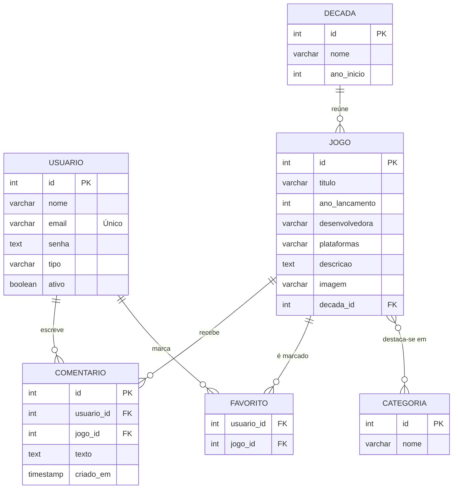

<div align="center">

# Game Erah

### Uma viagem pela evolução dos jogos, década por década


[Sobre](#-sobre-o-projeto) · [Como rodar](#-como-rodar-o-projeto) · [Estrutura](#-estrutura-de-pastas) · [Requisitos](#-requisitos) · [Banco de dados](#-banco-de-dados) · [Diagramas](#-diagramas)

</div>

---

## Sobre o projeto

O **Game Erah** é uma aplicação web feita em **PHP** com banco de dados **PostgreSQL** que conta a história dos videogames de um jeito simples e visual. Cada década tem seus jogos de destaque, e quem visita o site consegue ver como a tecnologia, os gráficos e a jogabilidade mudaram ao longo do tempo.

A plataforma tem dois tipos de acesso:

| Perfil | O que pode fazer |
|--------|------------------|
| **Visitante** | Navegar pelas décadas, filtrar jogos por categoria, buscar um jogo e ver a ficha técnica |
|  **Usuário cadastrado** | Tudo do visitante + favoritar jogos e enviar comentários |
| **Administrador** | Gerenciar (CRUD) usuários, jogos, décadas e categorias de destaque |

> [!NOTE]
> O CRUD completo (cadastrar, listar, atualizar e apagar) funciona integrado ao banco PostgreSQL, tanto para usuários quanto para o conteúdo do site.

---

##  Índice

- [Sobre o projeto](#-sobre-o-projeto)
- [Como rodar o projeto](#-como-rodar-o-projeto)
  - [Pré-requisitos](#pré-requisitos)
  - [Início rápido](#início-rápido)
  - [Passo a passo detalhado](#passo-a-passo-detalhado)
- [Estrutura de pastas](#-estrutura-de-pastas)
- [Requisitos](#-requisitos)
  - [Funcionais](#requisitos-funcionais)
  - [Não funcionais](#requisitos-não-funcionais)
  - [Regras de negócio](#regras-de-negócio)
- [O que o sistema faz (casos de uso)](#-o-que-o-sistema-faz)
- [Banco de dados](#-banco-de-dados)
- [Diagramas](#-diagramas)
- [Protótipos](#-protótipos)
- [Como contribuir](#-como-contribuir)
- [Contato](#-contato)

---

##  Como rodar o projeto

### Pré-requisitos

Antes de começar, confira se você tem na máquina:

- **PHP 7.4 ou superior**, com a extensão `pdo_pgsql` habilitada
- **PostgreSQL** instalado e rodando na porta `5432`
- **Git**

### Início rápido

Se você já tem tudo instalado e só quer ver funcionando, estes são os comandos em ordem (os detalhes de cada um estão logo abaixo):

```bash
git clone https://github.com/Livia-MP-Null/game_erah.git
cd game_erah
# crie o banco e o usuário (Passo 2), ajuste database/connect.php (Passo 3)
php -S localhost:8000
```

Depois é só abrir **http://localhost:8000** no navegador.

### Passo a passo detalhado

<details>
<summary><b>1️ Clonar o repositório</b></summary>

<br>

Abra o *Git Bash* e rode:

```bash
# Baixa o projeto do GitHub
git clone https://github.com/Livia-MP-Null/game_erah.git

# Entra na pasta do projeto
cd game_erah
```

</details>

<details>
<summary><b>2️ Criar o banco de dados</b></summary>

<br>

O arquivo SQL com toda a estrutura do banco fica na pasta `database`.

**a)** Abra o terminal e conecte no Postgres com o usuário padrão:

```bash
psql -U postgres
```

**b)** Se já existir um banco de testes anterior, apague e crie de novo:

```sql
DROP DATABASE IF EXISTS game_erahdb;
CREATE DATABASE game_erahdb;
```

**c)** Crie um usuário exclusivo para o projeto e torne-o dono do banco:

```sql
CREATE USER game_erah WITH PASSWORD 'sua_senha';
ALTER DATABASE game_erahdb OWNER TO game_erah;
\q
```

> [!TIP]
> No SQL, a senha vai entre **aspas simples** (`'sua_senha'`). Aspas duplas fazem o Postgres entender como nome de coluna e dá erro.

**d)** Restaure as tabelas e os registros usando o arquivo de dump:

```bash
cd database
psql -U game_erah -h localhost -d game_erahdb -f dumpgame_erahdb.sql
cd ..
```

</details>

<details>
<summary><b>3️ Configurar a conexão no PHP</b></summary>

<br>

Abra o arquivo `database/connect.php` no VSCode e altere **somente** a senha:

```php
$host     = "localhost";      // não altere
$dbname   = "game_erahdb";    // não altere
$user     = "game_erah";      // não altere
$password = "SUA_SENHA_AQUI"; // altere apenas este campo
```

</details>

<details>
<summary><b>4️ Abrir a aplicação</b></summary>

<br>

Na raiz do projeto, inicie o servidor embutido do PHP:

```bash
# se não estiver na raiz ainda
cd game_erah

php -S localhost:8000
```

Pronto! Abra **http://localhost:8000** no navegador e aproveite. 🎉

</details>

---

## 🗂️ Estrutura de pastas

```
game_erah
│   index.php                 → página inicial
│   README.md
├───app                       → telas e ações do CRUD
│       create.php
│       select.php
│       select_w.php
│       update.php
│       delete.php
├───css
│       style.css             → estilos do site
├───database
│       connect.php           → conexão com o PostgreSQL
│       dumpgame_erahdb.sql   → estrutura e dados do banco
├───includes
│       header.php            → cabeçalho reaproveitado
│       footer.php            → rodapé reaproveitado
└───login
        login.php
        cadastrar.php
        logout.php
```


---

##  Requisitos

### Requisitos funcionais

| ID | Título | Descrição | Prioridade | Feito? |
|----|--------|-----------|:----------:|:------:|
| **RF01** | Cadastro de usuário | Permitir o registro de novos usuários | Alta |  |
| **RF02** | Relatório de usuários | Listar todos os usuários cadastrados na plataforma | Alta |  |
| **RF03** | Atualização de usuário | Permitir alterar dados e o estado do usuário (Ativo ou Inativo) | Alta |  |
| **RF04** | Exclusão de usuário | Permitir apagar o registro de um usuário do banco de dados | Alta |  |
| **RF05** | Consulta de usuário | Exibir as informações de um usuário a partir do seu id | Alta |  |
| **RF06** | Linha do tempo por décadas | Permitir navegar pela história dos jogos dividida em décadas | Alta |  |
| **RF07** | Filtro por categoria | Filtrar os jogos de cada época em *Mais jogados*, *Melhor qualidade gráfica* e *Melhor jogabilidade* | Média |  |
| **RF08** | Ficha técnica do jogo | Exibir uma página por jogo com ano, desenvolvedora, plataformas, imagens/vídeos e uma breve descrição do impacto cultural | Média |  |
| **RF09** | Painel administrativo | Permitir que administradores cadastrem, editem ou removam jogos, usuários, décadas e categorias | Média |  |
| **RF10** | Busca global | Permitir pesquisar um jogo pelo nome na barra de busca | Baixa |  |
| **RF11** | Favoritar jogo | Permitir que o usuário logado favorite e desfavorite jogos | Baixa |  |
| **RF12** | Comentar jogo | Permitir que o usuário logado envie comentários na página de um jogo | Baixa |  |


### Requisitos não funcionais

| ID | Título | Descrição | Prioridade | Feito? |
|----|--------|-----------|:----------:|:------:|
| **RNF01** | Responsividade | A interface deve funcionar bem em celulares, tablets e computadores | Baixa |  |
| **RNF02** | Desempenho de mídia | Imagens e vídeos devem carregar de forma otimizada (WebP e *lazy loading*), com a página inicial abrindo em menos de 2,5 s | Média |  |
| **RNF03** | Estética e design | Visual temático inspirado na cultura gamer, com modo escuro, detalhes em neon e transições que lembrem a evolução gráfica | Baixa |  |
| **RNF04** | Disponibilidade | Hospedagem com pelo menos 99,5% de tempo online | Baixa |  |
| **RNF05** | SEO | Seguir boas práticas de SEO para que as páginas de jogos e décadas apareçam bem no Google | Alta |  |
| **RNF06** | Segurança | Usar *prepared statements* nas consultas e `password_hash()` para guardar senhas | Alta |  |

### Regras de negócio

| ID | Regra | Descrição |
|----|-------|-----------|
| **RN01** | E-mail único | Não é permitido cadastrar dois usuários com o mesmo e-mail |
| **RN02** | Acesso do administrador | Somente administradores acessam o painel e gerenciam jogos, décadas e categorias |
| **RN03** | Usuário inativo | Usuários com estado *Inativo* não conseguem fazer login |
| **RN04** | Login para interagir | Favoritar e comentar exigem sessão ativa |
| **RN05** | Favorito único | Um usuário só pode favoritar o mesmo jogo uma vez |
| **RN06** | Campos obrigatórios | Todo jogo precisa ter título, ano de lançamento e década |

---

##  O que o sistema faz

| # | Ação | Quem pode | Exige login? |
|---|------|-----------|:------------:|
| 1 | Criar usuário | Qualquer pessoa | Não |
| 2 | Excluir usuário | Administrador | Sim |
| 3 | Consultar todos os usuários | Administrador | Sim |
| 4 | Consultar um usuário específico | Administrador | Sim |
| 5 | Atualizar cadastro de usuário | Administrador | Sim |
| 6 | Consultar jogos por década e categoria | Qualquer pessoa | Não |
| 7 | Ver detalhes de um jogo específico | Qualquer pessoa | Não |
| 8 | Favoritar um jogo | Usuário cadastrado | Sim |
| 9 | Enviar comentário sobre um jogo | Usuário cadastrado | Sim |

---


### `usuario`

| Campo | Tipo | Restrições | Descrição |
|-------|------|-----------|-----------|
| `id` | SERIAL | PRIMARY KEY | Identificador do usuário |
| `nome` | VARCHAR(100) | NOT NULL | Nome de exibição |
| `email` | VARCHAR(255) | UNIQUE, NOT NULL | E-mail usado no login |
| `senha` | TEXT | NOT NULL | Senha criptografada com `password_hash()` |
| `tipo` | VARCHAR(10) | NOT NULL, padrão `comum` | `comum` ou `admin` |
| `ativo` | BOOLEAN | NOT NULL, padrão `true` | Estado do usuário (Ativo/Inativo) |

### `decada`

| Campo | Tipo | Restrições | Descrição |
|-------|------|-----------|-----------|
| `id` | SERIAL | PRIMARY KEY | Identificador da década |
| `nome` | VARCHAR(50) | UNIQUE, NOT NULL | Ex.: "Anos 80" |
| `ano_inicio` | INT | NOT NULL | Ex.: 1980 |

### `categoria`

| Campo | Tipo | Restrições | Descrição |
|-------|------|-----------|-----------|
| `id` | SERIAL | PRIMARY KEY | Identificador da categoria |
| `nome` | VARCHAR(60) | UNIQUE, NOT NULL | Mais jogados, Melhor qualidade gráfica, Melhor jogabilidade |

### `jogo`

| Campo | Tipo | Restrições | Descrição |
|-------|------|-----------|-----------|
| `id` | SERIAL | PRIMARY KEY | Identificador do jogo |
| `titulo` | VARCHAR(150) | NOT NULL | Nome do jogo |
| `ano_lancamento` | INT | NOT NULL | Ano em que foi lançado |
| `desenvolvedora` | VARCHAR(100) | | Empresa que criou o jogo |
| `plataformas` | VARCHAR(200) | | Plataformas originais |
| `descricao` | TEXT | | Breve descrição do impacto cultural |
| `imagem` | VARCHAR(255) | | Caminho da imagem principal |
| `decada_id` | INT | FOREIGN KEY → `decada.id` | Década do jogo |

### `jogo_categoria` (um jogo pode estar em várias categorias)

| Campo | Tipo | Restrições | Descrição |
|-------|------|-----------|-----------|
| `jogo_id` | INT | FK → `jogo.id` | Jogo |
| `categoria_id` | INT | FK → `categoria.id` | Categoria de destaque |

Chave primária composta: (`jogo_id`, `categoria_id`).

### `favorito`

| Campo | Tipo | Restrições | Descrição |
|-------|------|-----------|-----------|
| `usuario_id` | INT | FK → `usuario.id` | Quem favoritou |
| `jogo_id` | INT | FK → `jogo.id` | Jogo favoritado |

Chave primária composta: (`usuario_id`, `jogo_id`), o que garante a regra RN05.

### `comentario`

| Campo | Tipo | Restrições | Descrição |
|-------|------|-----------|-----------|
| `id` | SERIAL | PRIMARY KEY | Identificador do comentário |
| `usuario_id` | INT | FK → `usuario.id`, NOT NULL | Autor |
| `jogo_id` | INT | FK → `jogo.id`, NOT NULL | Jogo comentado |
| `texto` | TEXT | NOT NULL | Conteúdo do comentário |
| `criado_em` | TIMESTAMP | padrão `now()` | Data e hora do envio |

---

## 🧭 Diagramas

### Modelo Entidade-Relacionamento




##  Protótipos

**Baixa fidelidade:** _em breve_

**Alta fidelidade:** [Clique aqui para ver no Figma](https://www.figma.com/design/ADrwIyHNxIPXHmH4bonXNR/E-Learning-Site--Community-?node-id=0-1&t=kyFfQaBdBLAscwWi-1)


---

##  Como contribuir

1. Faça um **fork** do projeto
2. Crie uma branch para sua ideia
   ```bash
   git checkout -b feature/minha-ideia
   ```
3. Salve suas mudanças
   ```bash
   git commit -m "Adiciona minha ideia"
   ```
4. Envie para o seu fork
   ```bash
   git push origin feature/minha-ideia
   ```
5. Abra um **Pull Request**

---

##  Contato

- **Autora:** Livia
- **GitHub:** [@Livia-MP-Null](https://github.com/Livia-MP-Null)

<div align="center">

Feito com 💜 para quem ama jogos.

</div>
